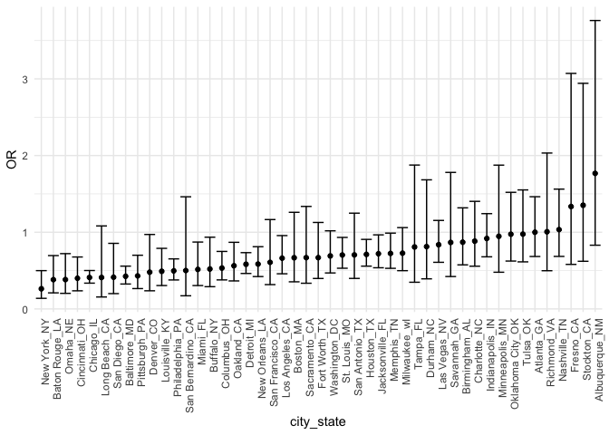

Homework 6: Linear Models
================
Kristina Howell

``` r
# These settings will be used throughout the document.

library(tidyverse)
library(modelr)
library(p8105.datasets)

theme_set(theme_minimal() + theme(legend.position = "bottom"))

options(
  ggplot2.continuous.colour = "viridis", 
  ggplot2.continuous.fill = "viridis"
)

scale_colour_discrete = scale_color_viridis_d
scale_fill_discrete = scale_fill_viridis_d

set.seed(1)

`%notin%` <- Negate(`%in%`)
```

## Problem 1

#### Data Tidying

``` r
homicide_df = 
  
  # Import the data
  read_csv("./data/homicide-data.txt", na = c("", "NA", "Unknown")) %>% 
  
  # Create city_state variable and binary resolved variable
  mutate(
    city_state = str_c(city, state, sep = "_"),
    resolved = case_when(
      disposition == "Closed without arrest" ~ 0,
      disposition == "Open/No arrest" ~ 0,
      disposition == "Closed by arrest" ~ 1)) %>% 
  
  # Remove unnecessary cities
  filter(city_state != "Tulsa_AL") %>% 
           # c("Tulsa_AL", "Dallas_TX", "Phoenix_AZ", "Kansas City_MO")) 
           
  # Include specific races
  filter(victim_race %in% c("White", "Black")) %>% 
  
  # Convert age to a numeric
  mutate(victim_age = as.numeric(victim_age),
         victim_race = as.factor(victim_race),
         victim_sex = as.factor(victim_sex)) %>% 
  
  # Retain only important variables
  select(city_state, resolved, victim_age, victim_race, victim_sex)
```

``` r
# Create a dataframe with only Baltimore, MD
baltimore_df = 
  homicide_df %>% 
  filter(city_state == "Baltimore_MD")

# Fit a logistic regresison model 
glm(resolved ~ victim_age + victim_race + victim_sex,
    data = baltimore_df,
    family = binomial()) %>% 
  broom::tidy() %>% 
  
  # Obtain OR and CI
  mutate(
    OR = exp(estimate),
    CI_lower = exp(estimate - 1.96 * std.error),
    CI_upper = exp(estimate + 1.96 * std.error)) %>% 
  
  # Retain necessary variables and create a table
  select(term, OR, starts_with("CI")) %>% 
  knitr::kable(digits = 3)
```

| term              |    OR | CI\_lower | CI\_upper |
| :---------------- | ----: | --------: | --------: |
| (Intercept)       | 1.363 |     0.975 |     1.907 |
| victim\_age       | 0.993 |     0.987 |     1.000 |
| victim\_raceWhite | 2.320 |     1.648 |     3.268 |
| victim\_sexMale   | 0.426 |     0.325 |     0.558 |

``` r
models_results_df = 
  homicide_df %>% 
    nest(data = -city_state) %>% 
    mutate(
      models = 
        map(.x = data, 
            ~glm(resolved ~ victim_age + victim_race + victim_sex,
                 data = .x,
                 family = binomial())), 
      results = map(models, broom::tidy)) %>% 
    select(city_state, results) %>% 
    unnest(results) %>% 
    mutate(
      OR = exp(estimate),
      CI_lower = exp(estimate - 1.96 * std.error),
      CI_upper = exp(estimate + 1.96 * std.error)) %>% 
  select(city_state, term, OR, starts_with("CI"))
```

``` r
models_results_df %>% 
  filter(term == "victim_sexMale") %>% 
  mutate(city_state = fct_reorder(city_state, OR)) %>% 
  ggplot(aes(x = city_state, y = OR)) +
    geom_point() +
    geom_errorbar(aes(ymin = CI_lower, ymax = CI_upper)) +
    theme(axis.text.x = element_text(angle = 90, hjust = 1))
```

<!-- -->

## Problem 2
