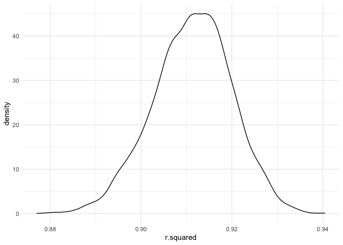

Homework 6: Linear Models
================
Kristina Howell

``` r
# These settings will be used throughout the document.

library(tidyverse)
library(modelr)
library(p8105.datasets)
library(mgcv)

theme_set(theme_minimal() + theme(legend.position = "bottom"))

options(
  ggplot2.continuous.colour = "viridis", 
  ggplot2.continuous.fill = "viridis"
)

scale_colour_discrete = scale_color_viridis_d
scale_fill_discrete = scale_fill_viridis_d

set.seed(1)

`%notin%` <- Negate(`%in%`)
```

## Problem 1

#### Data Tidying

``` r
homicide_df = 
  
  # Import the data
  read_csv("./data/homicide-data.txt", na = c("", "NA", "Unknown")) %>% 
  
  # Create city_state variable and binary resolved variable
  mutate(
    city_state = str_c(city, state, sep = "_"),
    resolved = case_when(
      disposition == "Closed without arrest" ~ 0,
      disposition == "Open/No arrest" ~ 0,
      disposition == "Closed by arrest" ~ 1)) %>% 
  
  # Remove unnecessary cities
  filter(city_state != "Tulsa_AL") %>% 
           # c("Tulsa_AL", "Dallas_TX", "Phoenix_AZ", "Kansas City_MO")) 
           
  # Include specific races
  filter(victim_race %in% c("White", "Black")) %>% 
  
  # Convert age to a numeric
  mutate(victim_age = as.numeric(victim_age),
         victim_race = as.factor(victim_race),
         victim_sex = as.factor(victim_sex)) %>% 
  
  # Retain only important variables
  select(city_state, resolved, victim_age, victim_race, victim_sex)
```

#### Fitting the model for Baltimore

``` r
# Create a dataframe with only Baltimore, MD
baltimore_df = 
  homicide_df %>% 
  filter(city_state == "Baltimore_MD")

# Fit a logistic regresison model 
glm(resolved ~ victim_age + victim_race + victim_sex,
    data = baltimore_df,
    family = binomial()) %>% 
  broom::tidy() %>% 
  
  # Obtain OR and CI
  mutate(
    OR = exp(estimate),
    CI_lower = exp(estimate - 1.96 * std.error),
    CI_upper = exp(estimate + 1.96 * std.error)) %>% 
  
  # Retain necessary variables and create a table
  select(term, OR, starts_with("CI")) %>% 
  knitr::kable(digits = 3)
```

| term              |    OR | CI\_lower | CI\_upper |
| :---------------- | ----: | --------: | --------: |
| (Intercept)       | 1.363 |     0.975 |     1.907 |
| victim\_age       | 0.993 |     0.987 |     1.000 |
| victim\_raceWhite | 2.320 |     1.648 |     3.268 |
| victim\_sexMale   | 0.426 |     0.325 |     0.558 |

#### Map the model over the dataset

``` r
models_results_df = 
  homicide_df %>% 
  
    # Nest the data
    nest(data = -city_state) %>% 
  
    # Use map to perform linear regression over the dataset
    mutate(
      models = 
        map(.x = data, 
            ~glm(resolved ~ victim_age + victim_race + victim_sex,
                 data = .x,
                 family = binomial())), 
      results = map(models, broom::tidy)) %>% 
  
    # Tidy results
    select(city_state, results) %>% 
    unnest(results) %>% 
  
    # Calculate Odds Ratios and Confidence Intervals
    mutate(
      OR = exp(estimate),
      CI_lower = exp(estimate - 1.96 * std.error),
      CI_upper = exp(estimate + 1.96 * std.error)) %>% 
  select(city_state, term, OR, starts_with("CI"))
```

#### Visualization

``` r
# Odds of a male homicide case being solved as compared to a female's by city

models_results_df %>% 
  filter(term == "victim_sexMale") %>% 
  mutate(city_state = fct_reorder(city_state, OR)) %>% 
  ggplot(aes(x = city_state, y = OR)) +
    geom_point() +
    geom_errorbar(aes(ymin = CI_lower, ymax = CI_upper)) +
    theme(axis.text.x = element_text(angle = 90, hjust = 1))
```

<!-- -->

## Problem 2

#### Import and Tidy Data

``` r
bwt_df = 
  
  # Import dataset using read_csv
  read_csv("./data/birthweight.csv") %>% 
  drop_na() %>% 
  
  # Retain only necessary variables
  select(bwt, blength, gaweeks, bhead, babysex, wtgain, mrace, fincome) %>% 
  
  # Relabel race categories and convert to factor
   mutate(
     mrace = case_when(
      mrace == 1 ~ "White",
      mrace == 2 ~ "Black",
      mrace == 3 ~ "Asian",
      mrace == 4 ~ "Puerto Rican",
      mrace == 8 ~ "Other"),
     mrace = as.factor(mrace),
    
  # Relabel baby's sex categories and convert to factor
    babysex = case_when(
      babysex == 1 ~ "Male",
      babysex == 2 ~ "Female"), 
   babysex = as.factor(babysex))
```

The first prespecified models are as follows:

  - **Model 1:** birthweight \~ length at birth + gestational age

  - **Model 2:** birthweight \~ head circumference | length | sex

My proposed model focuses on the mother’s weight gain during pregnancy
in pounds `wtgain` and family income `fincome` on the outcome variable,
birthweight `btw`. This model is based on the social determinants of
health, nutritional access, and financial barriers that may affect the
health of the mother and baby, measured through birthweight.

The model is as follows:

  - **Model 3:** birthweight \~ weight gain + family income

#### Fit linear models

``` r
fit1 = lm(bwt ~ blength + gaweeks, data = bwt_df)

fit2 = lm(bwt ~ blength + bhead + babysex + 
                blength*bhead + blength*babysex + bhead*babysex +
                blength*bhead*babysex,
              data = bwt_df)

fit3 = lm(bwt ~ wtgain + fincome, data = bwt_df)

fit1 %>% 
broom::tidy()
```

    ## # A tibble: 3 x 5
    ##   term        estimate std.error statistic  p.value
    ##   <chr>          <dbl>     <dbl>     <dbl>    <dbl>
    ## 1 (Intercept)  -4348.      98.0      -44.4 0.      
    ## 2 blength        129.       1.99      64.6 0.      
    ## 3 gaweeks         27.0      1.72      15.7 2.36e-54

``` r
fit2 %>% 
broom::tidy()
```

    ## # A tibble: 8 x 5
    ##   term                      estimate std.error statistic    p.value
    ##   <chr>                        <dbl>     <dbl>     <dbl>      <dbl>
    ## 1 (Intercept)                -802.    1102.       -0.728 0.467     
    ## 2 blength                     -21.6     23.4      -0.926 0.354     
    ## 3 bhead                       -16.6     34.1      -0.487 0.626     
    ## 4 babysexMale               -6375.    1678.       -3.80  0.000147  
    ## 5 blength:bhead                 3.32     0.713     4.67  0.00000317
    ## 6 blength:babysexMale         124.      35.1       3.52  0.000429  
    ## 7 bhead:babysexMale           198.      51.1       3.88  0.000105  
    ## 8 blength:bhead:babysexMale    -3.88     1.06     -3.67  0.000245

``` r
fit3 %>% 
broom::tidy()
```

    ## # A tibble: 3 x 5
    ##   term        estimate std.error statistic  p.value
    ##   <chr>          <dbl>     <dbl>     <dbl>    <dbl>
    ## 1 (Intercept)  2718.      21.1       129.  0.      
    ## 2 wtgain         11.7      0.679      17.2 2.84e-64
    ## 3 fincome         3.13     0.286      10.9 1.96e-27

All models appear to have a significant relationship between predictors
and outcome.

#### Check residual plots

``` r
modelr::add_residuals(bwt_df, fit3) %>% 
  ggplot(aes(x = wtgain, y = resid, color = fincome)) +
  geom_point()  
```

<!-- -->

``` r
bwt_df %>% 
  modelr::add_residuals(fit3) %>% 
  ggplot(aes(x = fincome, y = resid, color = wtgain)) + 
  geom_point(alpha = 0.8) 
```

<!-- -->

With both predictors for model 3 (wtgain, fincome), residuals appear
randomly scattered around the 0 line.

#### Cross validation

``` r
cv_df = 
  
  # Run cross validation on the bwt_df
  crossv_mc(bwt_df, 100) %>% 
  
  # Convert training and test observations to a tibble
  mutate(
    train = map(train, as_tibble), 
    test = map(test, as_tibble)) %>% 
  
  # Map the linear models over the training dataset
  mutate(
      fit1 = 
        map(.x = train, ~lm(bwt ~ blength + gaweeks, data = .x)),
      
      fit2 = 
        map(.x = train, ~lm(bwt ~ blength + bhead + babysex + 
                            blength*bhead + blength*babysex + bhead*babysex +
                            blength*bhead*babysex, 
                          data = .x)),
      
      fit3 = 
        map(.x = train, ~lm(bwt ~ wtgain + fincome, data = .x))) %>% 
  
  # Obtain rmse values of each model for the test dataset
  mutate(
      rmse_fit1 = map2_dbl(.x = fit1, .y = test, 
                             ~rmse(model = .x, data = .y)),
      rmse_fit2 = map2_dbl(.x = fit2, .y = test, 
                             ~rmse(model = .x, data = .y)),
      rmse_fit3 = map2_dbl(.x = fit3, .y = test, 
                             ~rmse(model = .x, data = .y)))
```

#### Analysis of results

``` r
cv_df %>% 
  select(starts_with("rmse")) %>% 
  pivot_longer(
    everything(),
    names_to = "model",
    values_to = "rmse", 
    names_prefix = "rmse_"
  ) %>% 
  ggplot(aes(x = model, y = rmse)) + 
  geom_violin()
```

<!-- -->

Graphically, model 2 (interaction model) appears to have the lowest
average root mean square error of all three models, with model 1 only
slightly higher and model 3 much higher.

#### Calculate average RMSE

``` r
cv_df %>% 
  select(starts_with("rmse")) %>% 
  pivot_longer(
    everything(),
    names_to = "model",
    values_to = "rmse", 
    names_prefix = "rmse_"
  ) %>% 
  group_by(model) %>% 
  summarize(avg_rmse = mean(rmse))
```

    ## # A tibble: 3 x 2
    ##   model avg_rmse
    ##   <chr>    <dbl>
    ## 1 fit1      332.
    ## 2 fit2      289.
    ## 3 fit3      491.

The above table reports average root mean squared error, which confirms
the above interpretations.

#### Visualizations

``` r
bwt_df %>% 
ggplot(aes(x = wtgain, y = bwt)) +
  geom_point(alpha = 0.3) +
  geom_smooth(method = "lm", se = F,
              aes(group = fincome,                                  
              color = fincome))
```

<!-- -->

``` r
bwt_df %>% 
ggplot(aes(x = fincome, y = bwt)) +
  geom_point(alpha = 0.3) +
  geom_smooth(method = "lm")
```

<!-- -->

The above plots depict changes in outcome by predictor for model 3
(wtgain, fincome)

## Problem 3

#### Import the data

``` r
weather_df = 
  rnoaa::meteo_pull_monitors(
    c("USW00094728"),
    var = c("PRCP", "TMIN", "TMAX"), 
    date_min = "2017-01-01",
    date_max = "2017-12-31") %>%
  mutate(
    name = recode(id, USW00094728 = "CentralPark_NY"),
    tmin = tmin / 10,
    tmax = tmax / 10) %>%
  select(name, id, everything())
```

#### R- squared Bootstrap Distributions

``` r
# Run the bootstrap to create r - squared dataframe
boot_rsq = 
  weather_df %>% 
    bootstrap(5000, id = "strap_number") %>% 
    
    # Run the linear model across the bootstrap observations
    mutate(
      models = map(.x = strap, ~lm(tmax ~ tmin, data = .x)), 
      results = map(models, broom::glance)) %>% 
    
    # Tidy data
    select(strap_number, results) %>% 
    unnest(results) %>% 
    select(strap_number, r.squared) 
  

# Calculate average r-squared value for bootstrap observations
boot_rsq %>%   
  summarize(mean_r_square = mean(r.squared))
```

    ## # A tibble: 1 x 1
    ##   mean_r_square
    ##           <dbl>
    ## 1         0.911

The mean r squared value over 5000 bootstrap samples is equal to
\~0.911. About 91.1% of the variance in the maximum temperature is
explained by the minimum temperature in this linear regression.

``` r
# Create a distribution plot of r.squared values
boot_rsq %>% 
  ggplot(aes(x = r.squared)) +
  geom_density() 
```

<!-- -->

``` r
# Obtaining confidence intervals
ci_lower_r = quantile(pull(boot_rsq, r.squared), 0.025)
ci_upper_r = quantile(pull(boot_rsq, r.squared), 0.975)
```

The above plot depicts the distribution of r-squared values over 5000
bootstrap samples.

Quantile estimates for r-squared are 0.8936977 , 0.9274807. We are 95%
confident that the true r-squared falls between \~89.37% and \~92.74%.

#### Log(beta) Bootstrap Distributions

``` r
### Write a function to obtain log_beta value for each observation

obtain_log = function(df) {
 
   # Run the linear model and tify
  lm(tmax ~ tmin, data = df) %>% 
  broom::tidy() %>% 
    
  # Select necessary values
  select(term, estimate) %>% 
  
  # Tidy
  mutate(
    term = str_replace(term, "\\(Intercept\\)", "intercept")) %>% 
  pivot_wider(
    names_from = term,
    values_from = estimate) %>% 
    
  #Obtain log_beta values
  mutate(
    log_betas = log(intercept*tmin))

}


### Run the bootstrap to calculate mean log_betas

boot_log =
  weather_df %>% 
    bootstrap(5000, id = "strap_number") %>% 
    
    # Run the linear model across the bootstrap observations
    mutate(
      models = map(.x = strap, ~obtain_log(.x))) %>% 
    
    # Tidy data
    select(strap_number, models) %>% 
    unnest(models) %>% 
    select(strap_number, log_betas) 

# Calculate average log_betas value for bootstrap observations
boot_log %>% 
    summarize(mean_log_betas = mean(log_betas))
```

    ## # A tibble: 1 x 1
    ##   mean_log_betas
    ##            <dbl>
    ## 1           2.01

The average value of the log of beta\_0 by beta\_1 over 5000 bootstraps
is roughly equal to 2.01.

``` r
# Create a distribution plot of log_beta values
boot_log %>% 
  ggplot(aes(x = log_betas)) +
  geom_density() 
```

<!-- -->

``` r
# Obtaining confidence intervals
ci_lower_log = quantile(pull(boot_log, log_betas), 0.025)
ci_upper_log = quantile(pull(boot_log, log_betas), 0.975)
```

The above plot depicts the distribution of log(beta) values over 5000
bootstrap samples.

Quantile estimates for log(beta) are 1.9656328 , 2.0584694. We are 95%
confident that the true log(beta) falls between \~1.97 and \~2.06.
